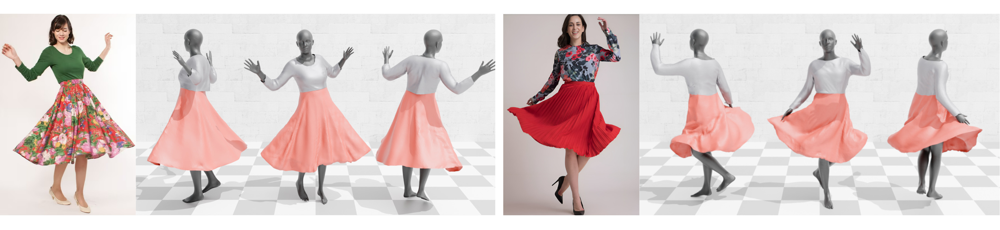

# Single View Garment Reconstruction Using Diffusion Mapping Via Pattern Coordinates
<p align="center"></p>

This is the repo for [**Single View Garment Reconstruction Using Diffusion Mapping Via Pattern Coordinates**](https://liren2515.github.io/page/dmap/dmap.html).

## Setup & Install
See [INSTALL.md](docs/INSTALL.md)

## Reconstruction
See [RECONSTRUCTION.md](docs/RECONSTRUCTION.md)

## Prepare your own data
If you want to prepare your own data for reconstruction, please check [DATA_PREPARE.md](docs/DATA_PREPARE.md)

## Citation
If you find our work useful, please cite it as:
```
@inproceedings{li2024garment,
  author = {Li, Ren and Cao, Cong and Dumery, Corentin You, Yingxuan and Li, Hao and Fua, Pascal},
  title = {{Single View Garment Reconstruction Using Diffusion Mapping Via Pattern Coordinates}},
  booktitle = {ACM SIGGRAPH 2025 Conference Papers},
  year = {2025}
}
```